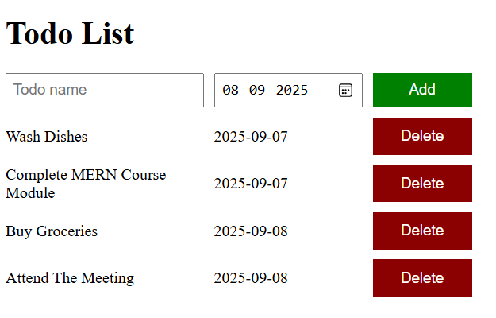

# ToDo-List

The **To-Do List** is a simple yet powerful task manager designed to help you stay productive and organized. You can add tasks, set due dates, and delete them once completed. With its clean design and responsive interactions, it makes task tracking smooth and efficient.  

---

## 📸 Screenshot Preview  
  

---

## 🛠️ Tools & Technologies Used  
- **HTML5** → For structuring the app.  
- **CSS3** → For styling and layout (grid-based design).  
- **JavaScript (Vanilla JS)** →  
  - Handling task addition and deletion.  
  - Using `forEach` for rendering lists dynamically.  
  - DOM manipulation with `querySelector` & `innerHTML`.  

---

## 📚 What I Learned  
- Building a **dynamic UI** with DOM manipulation.  
- Using **JavaScript arrays and objects** to store and manage data.  
- Implementing **event listeners** for buttons and inputs.  
- Applying **grid layouts** with CSS for a structured interface.  
- Writing **cleaner JavaScript code** with modern ES6 features like `forEach`, destructuring, and shorthand object properties.  

---

## 🎯 Conclusion  
This project gave me hands-on experience in combining **HTML, CSS, and JavaScript** to build an interactive app. It not only helped me strengthen my JavaScript fundamentals but also taught me how to create user-friendly and organized interfaces. The To-Do List is a small yet meaningful step in my journey of becoming a better web developer.  
